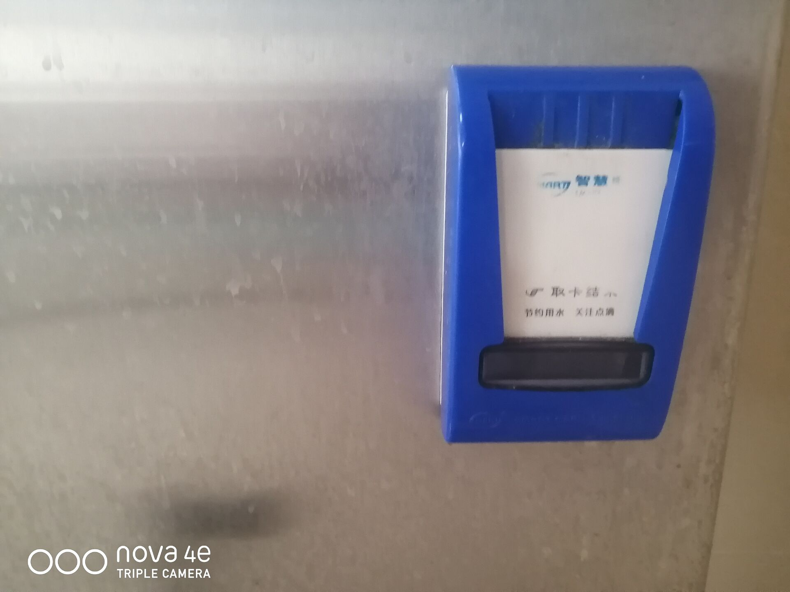
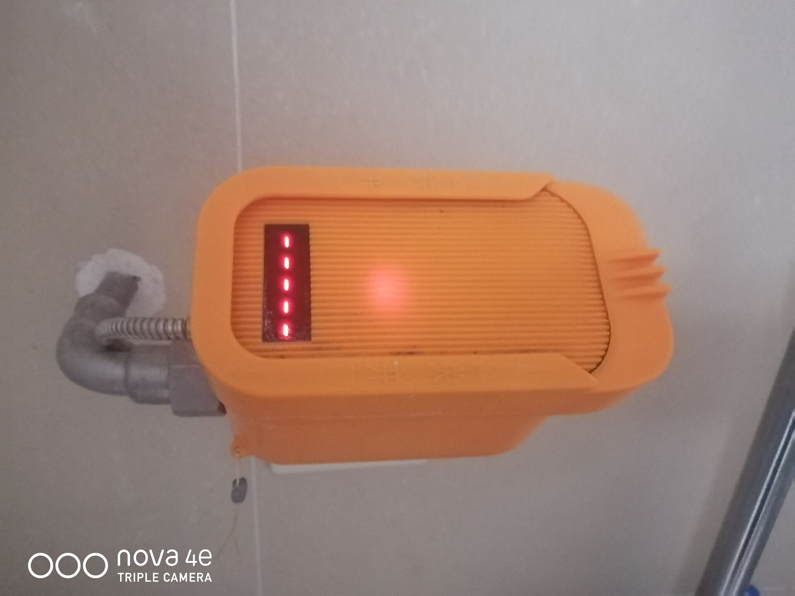
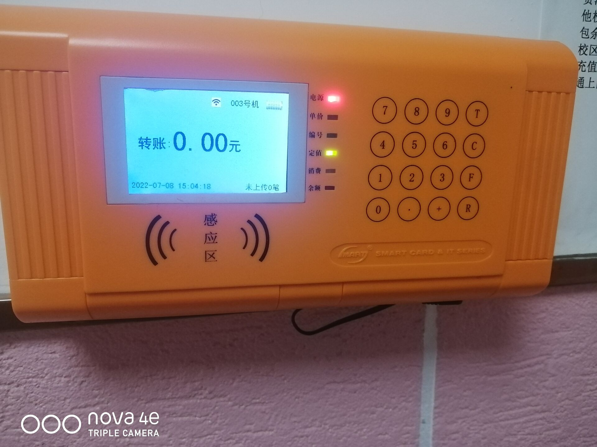

# 用水计费

用水计费主要分为热水与淋浴。中区的男女生宿舍每一层楼均配备一台热水机，男生宿舍的热水机位于公共洗漱间，女生宿舍的热水机位于每一层入口处的自习室旁边。一卡通接触感应区，听到“滴”的一声后拿开，放出开水并开始计费，再刷一下停止放水。中区的男生宿舍无独立卫浴，拥有统一的洗澡隔间，女生宿舍拥有独立卫浴，但均利用一卡通计费，每 5 秒一分钱。用水计费均通过透支记账的方式计费，不会直接扣除卡内费用，洗完澡后喷头处的卡机会显示-X.XX(元)，表示已经记账，用水消费后在销账卡机上刷卡（反应较慢，需停留 2-3 秒），会从卡内扣费并销账。男生宿舍的销账卡机位于洗浴间门口，女生宿舍位于热水机对面。注意用水最多透支 10 元，超出后停止供水，为防止出现洗一半停止供水的情况，一定要及时刷卡销账。下图 (a) 为热水卡机，(b) 为淋浴卡机，(c) 为销账卡机。

令人遗憾的是中区的宿舍没有直饮水的供应，热水也是收费的。但任意教学楼与图书馆均有免费的直饮水与热水供应，在这些地方打水也是不错的选择。

<figure><figcaption>
(a) 热水卡机
</figcaption></figure>

 

<figure><figcaption>
(b) 淋浴卡机
</figcaption></figure>

 

<figure><figcaption>
(c) 销账卡机
</figcaption></figure>

