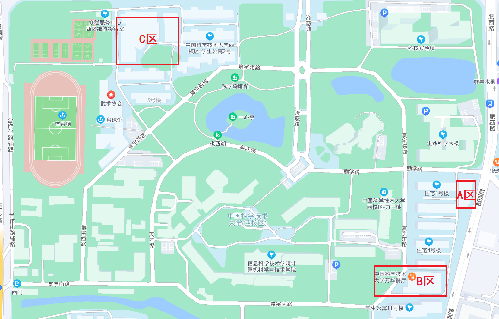

# 西区

下图为西区地图，文案所提地点均可在地图中找到。整体上西区餐厅的质量是比较高的。

<figure><figcaption>
西区地图
</figcaption></figure>

## A区

A区具体位置为西区肥西路东门进门后左转20米左右。该区几乎囊括了西区所有的生活区，有一个较大的学专超市，售卖丰富饮料、各种生活用品、体育用具、文具以及科大各种文创。

再往里还有京东派（取快递常用场所）、眼镜店、水果店、打印店（同时售卖往年真题）。

西区教工餐厅位于二楼，与东区一样需要餐券方可进入。

## B区

B区为西区常去的两个食堂。位于一楼为西苑餐厅，位于二楼为芳华饭厅，两个餐厅近两年均有装修，设施较新，环境较好。

### **西苑餐厅**

西苑餐厅与其余餐厅无明显差别，窗口售有牛肉汤、包子、炸鸡、汉堡、香锅、肉煲、拌饭、铁板面等，特色为猪肚鸡，也有快餐式打菜窗口。

### **芳华餐厅**

芳华餐厅拥有极为丰富的菜品，个人认为该食堂为最好吃的食堂之一。我们自左向右叙述食堂的窗口：

面与盖浇饭窗口：热干面较为推荐，同时供给很正宗的羊肉汤。

黄焖鸡、排骨窗口：个人感觉不够正宗，但味道尚可。

艾比克窗口：提供汉堡、炸鸡、比萨、薯条、碳酸饮料等，薯条量很大。(吐槽一波中东区食堂竟然没有汉堡？)

盖浇饭窗口：个人认为是芳华特色之一，人一般也较多，荤菜盖浇饭往往略贵。

焖面窗口：公认的芳华特色之一，砂锅中焖面，味道好，量大。

称重菜窗口：价格较东区中区较贵，味道不错。季节限定有螃蟹，荤菜有北京烤鸭、红烧肉、叉烧、广式腊肠等。

在其余窗口有新疆烤包、各种饼类、炒面、炸土豆、豆腐脑、西瓜（季节性）等供应，在西区芳华确实能吃到质量较好的正餐。该食堂与糕点房在一起，使得可选择项又多了一些。但有利必有弊，食堂的消费更高，排队时间也更长。（但是为了顿饱饭，这些都是可接受的hhhh）

## C区

由于离教学区较远，来C区概率大大降低，但C区菜品质量同样较高。该区域主要有金桔园餐厅、西区学生食堂、西三餐厅、正阳楼餐厅、报刊亭、烧烤摊、水果店、手抓饼摊。

将该建筑称为西区食堂。

### **金桔园餐厅**

金桔园是清真餐厅，与星座餐厅为同一家公司承保，菜品差距不大。打菜窗口没有称重肉菜，菜品较少，素菜多但菜量很大，中间是红薯粥包子窗口。(在金桔园可以看到很多外国人诶)

### 西区学生食堂

位于西区食堂一层，打菜窗口较为丰富，曾经提供轻食与小龙虾，可以期待一手，兼有煲饭与糕点房。

### **西三餐厅**

位于西区食堂二层，餐厅虽小但五脏俱全，拥有以下窗口：

炸串与小炒窗口：炸串食材干净且种类丰富，小炒价格实惠，干锅素菜系列中兼有不少荤菜，属于是一个人也能吃且经济实惠的小炒。

冒菜窗口：除冒菜外兼提供火锅，火锅价格便宜且荤菜量大，甚至一锅牛肉与鸡肉价格仅30元左右。

蛋包饭窗口：同时有卤肉饭供应；

盖浇饭窗口：兼有各种煲出售；也有麻辣香锅。

### **正阳楼餐厅**

位于西区食堂二层，餐厅整体很小，但为西区唯一供应鲜榨果汁的餐厅。

打菜窗口：菜品种类不很多，但有牛蛙供应。

泡泡拌饭系列：同美食广场，发挥稳定。

### **报刊亭、水果摊、烧烤摊、手抓饼摊**

位于西区食堂门口。报刊亭较小，仅能满足部分报刊需求；烧烤摊与手抓饼摊味道尚可，但总是薛定谔出摊。
