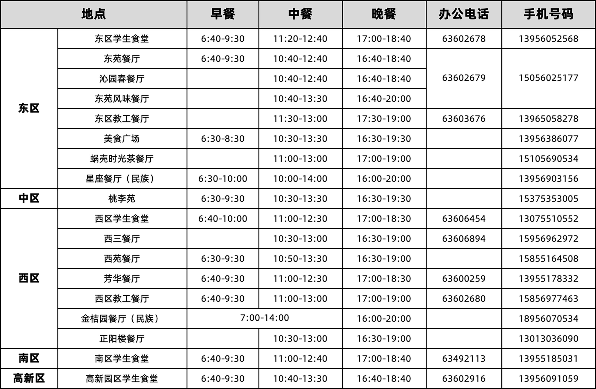

# 校内食堂联系方式及维权

## 联系方式

<figure><figcaption>
校内食堂供应时间和联系方式
</figcaption></figure>

## 维权

尽管我校食堂整体水平已经较高，但不可避免会出现疏漏。在食堂就餐时，凡遇饭菜价格、质量、卫生、服务态度等方面的问题均有权监督和投诉。监督和投诉的渠道为：

1. 现场找餐厅经理解决(推荐)
2. 按监督投诉电话进行投诉(如各食堂营业时间以及餐厅负责人联系方式部分所示)
3. 向饮食服务集团总经理信箱投诉，信箱为
4. 在各餐厅设有饮食服务工作意见簿，并指定专人管理，师生对饮食服务工作的投诉和建议可写入意见簿;
5. 通过校园网BBS饮食服务集团版进行投诉;
6. 关注微信服务号“科大饮食”，直接在对话框回复进行投诉。

引用我校《关于在学校食堂就餐吃到异物的赔偿意见》：

> 为了提高学校食堂的服务水平和质量，确保食品安全、卫生，规范食堂与就餐者之间关于在食堂吃出异物的管理，最终目的就是杜绝此类现象再次发生，特制定本“意见”，供食堂与就餐者参考执行。
>
> **一、处理程序：**
>
> 就餐者在学校食堂吃出异物时，按以下程序进行处理：
>
> 1.就餐者请携带异物，当即联系食堂现场值班经理要求解决。
>
> 2.上述人员若不能解决，应该向其上级领导汇报请示解决方法；就餐者还可以直接拨打后勤服务热线 0551-63606384 或服务监督电话 63606777 反应情况，要求解决。
>
> **二、赔偿标准：**
>
> 按照异物的不同种类，赔偿分为以下几个等级：
>
> 1.砂砾、棉线、蚊子、蚂蚁、头发、菜（米）虫、尼龙线，更换一份等值饭菜。
>
> 2.塑料纸（布）片、指甲，除更换一份等值饭菜外，按照该饭菜价格的十倍赔偿。
>
> 3.苍蝇、蟑螂，除更换一份等值饭菜外，按照该饭菜价格的二十倍赔偿。
>
> 4.蝗虫、蚂蝗、金属器（小于四厘米），除更换一份等值饭菜外，按照该饭菜价格的一百倍赔偿。
>
> 5.金属器（长于四厘米）、玻璃、锐器，除更换一份等值饭菜外，按照该饭菜价格的二百倍赔偿。
>
> **三、凡违反“食品卫生法”规定的，按照相关法律、法规处理。**
