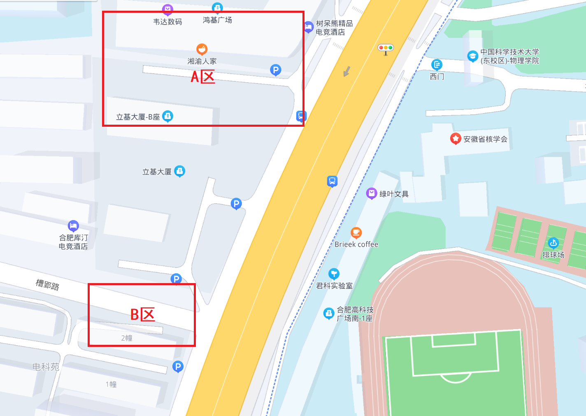
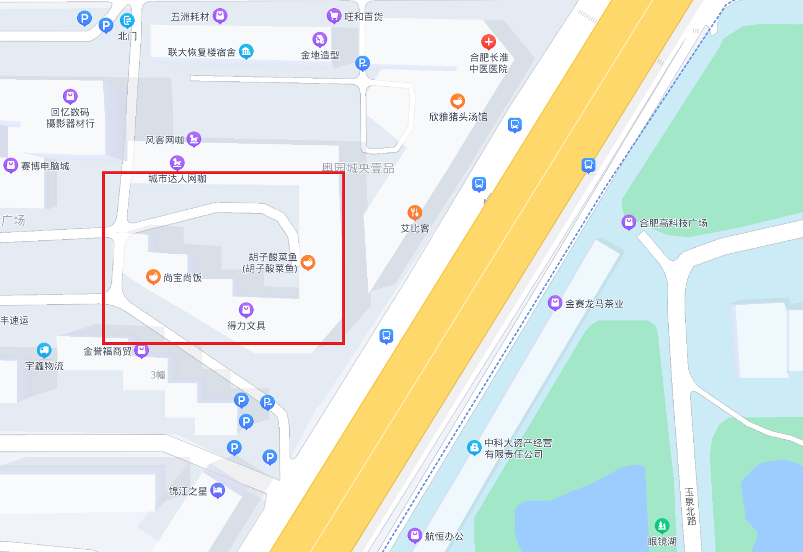
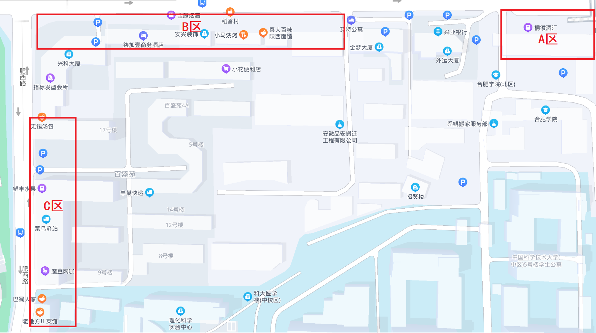

# 学校附近饮食

## 东区西门外金寨路

<figure><figcaption>
东区西门外金寨路地图
</figcaption></figure>

### A区：

有肯德基、汉堡王、老乡鸡快餐(以鸡汤闻名)、吉祥馄饨(主营面食、馄饨一类快餐)；

湘渝人家：提供湘菜、川菜，味道较好，且出示校园卡享受8.5折优惠；

疆场：提供新疆菜，有抓饭、大盘鸡、羊肉串等，较贴近西北地区口味，有歌手常驻助兴，但价格较昂贵。

### B区：

有小摊，九十点有夜宵摊出没。

## 东区西门外金寨路临近黄山路

<figure><figcaption>
东区西门外金寨路临近黄山路地图
</figcaption></figure>

红框所圈有酸菜鱼、唐家牛杂馆地锅鸡（皖北特色），味道极好，较为推荐。唐家内部包厢内有麻将桌，适合室内聚餐。

黄山路和金寨路交口西南角有巴郎子烧烤、塔斯汀等。味道都很不错。

## 中区黄山路北门与肥西路西门

<figure><figcaption>
中区黄山路北门与肥西路西门地图
</figcaption></figure>

### **A区：**

老火大骨头汤：在科大极为闻名的餐馆，老板极为热情，特色菜为骨头汤与拍黄瓜（极具有特色），出示科大学生卡可享受8折优惠，适合同学聚餐。

牛骨粉面馆：提供牛骨饭与牛骨面，牛骨味道为微辣。

### **B区：**

该区为一排餐馆，小店占据绝大多数，由东向西叙述部分餐馆：

劈柴炖锅农家菜：店面较大，环境较好，味道较好。特色菜为地锅鸡，由于现炖出餐速度较慢，建议预定。

秦人百味陕西面馆：特色为油泼面、瓦罐面，味道较为正宗，属于是喜欢吃面同学的福音，美中不足在于店面极小，环境较差。

小马烧烤：主营烧烤，常营业至深夜，提供深夜烧烤、龙虾等，但店内卫生条件一般。

川人川菜：主营川菜，店面较大，环境较好，下文中会将其与另外两家川菜馆比较。

陕西面馆：主营陕西各种面类(如臊子面、油泼面等)与腊汁肉夹馍，量大味道较好且较为正宗，价格适中，亦为喜欢吃面同学的福音。

重庆鸡公煲：有三家不同的重庆鸡公煲，味道均较好，店面环境尚可，价格适中，一人或多人均可享用。其中一家提供免费柠檬水，较为推荐。

四东煎饼：早上七点至晚上九点营业，提供极好吃的煎饼，兼有原味与果蔬口味煎饼，亦提供鸡蛋灌饼、豆浆，为早餐的好去处，不足之处为窗口小店，无堂食。

东北王食府：提供东北菜，较贴近黑龙江风格，较正宗，每份菜量极大（通常餐馆 2 人可点 3 个菜，这里 2 人极有可能吃不完两份菜），特色为锅包肉，价格适中。

美味猪头汤：很好吃很平价的一家店，比较家常，菜比较咸，招牌猪头汤真的很好吃。

### **C区：**

该区为肥西路一排的诸多餐饮，由北向南叙述部分餐馆：

无锡汤包：主要提供特色小笼包，味道较好，但每一份分量略小，价格整体较高。

肥叔锅贴：主营锅贴，亦提供快餐面、饭，为连锁店。

小高米线：主营各类米线，酸辣粉、面条也有出售，煎包较为好吃，为连锁店。

么肆烤肉：为该路上消费最高的餐厅，主营韩式烤肉（因此消费最高），可改善生活，但想吃饱价格略贵。

巴蜀人家、老地方川菜馆：为科大学生聚餐频率较高餐厅，均主营川菜，巴蜀人家的烤鱼、辣子鸡均受到大部分同学好评。两家川菜馆与川人川菜各有千秋，总体而言味道不相上下，川人川菜价格相对便宜。因此建议少部分同学聚会去川人川菜，较多同学聚会去巴蜀人家/老地方。

杨国福麻辣烫：连锁店，骨汤麻辣烫，大部分同学应该吃过很多。

富平烧烤、马氏烧烤：主营烧烤，营业至深夜，有夜宵。

老高烧烤：这个店不大，里面的米线比较便宜，不过没有小高米线那么好吃，单单从性价比来说还是比较高的，烧烤的话其实和其他的店面没有什么区别，但是老板是真的好，说得是人品方面(但是食堂有些阿姨也会给我加一点菜之类的)。

清又真兰州牛肉面：大部分同学认为味道尚可，价格较正宗兰州牛肉面便宜不少，离学校距离较近，对牛肉面有追求的同学请慎重选择。

沙县小吃：主营各类快餐，包括拌面、盖浇饭等，味道与价格均适中。

## 庐州太太

庐州太太是不得不提及的餐厅，省内同学聚餐、社团聚餐很多均在这里。各类菜系均有提供，符合大部分同学口味，价格适中。具体地址为包河区金寨路与望江路口南七商业大厦南侧，订餐电话为 0551-63658777。
